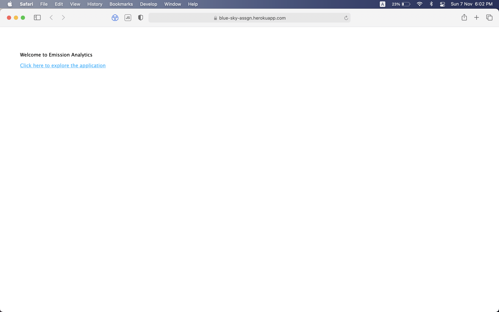
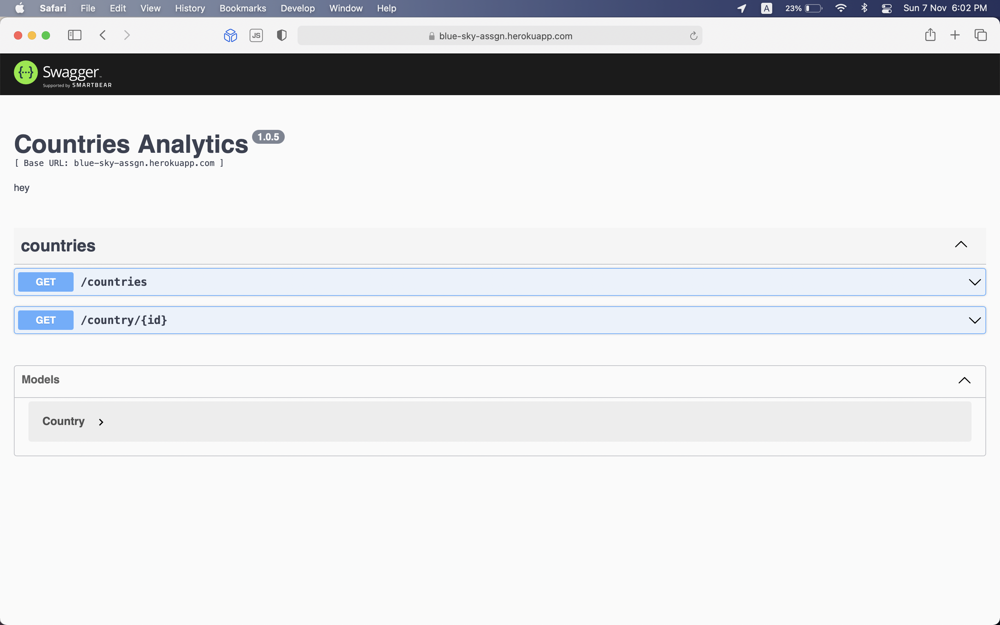
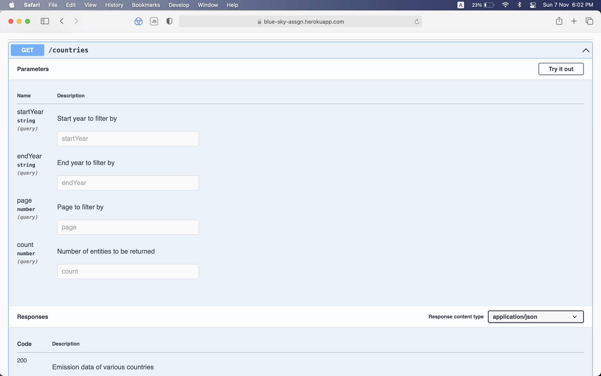
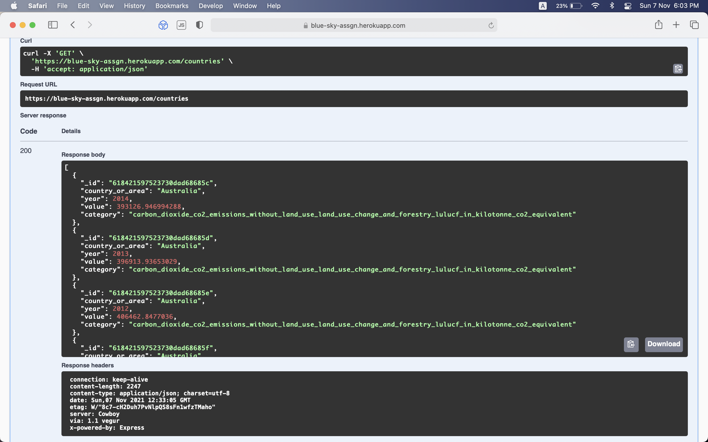
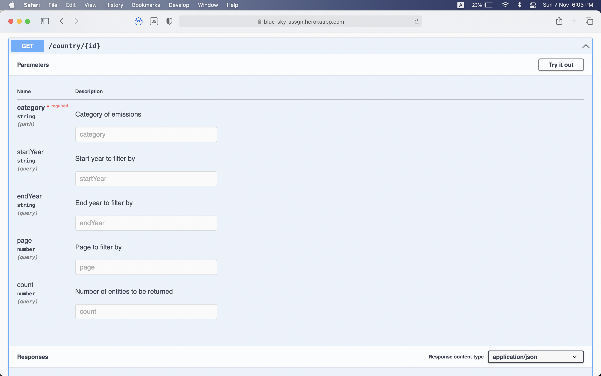
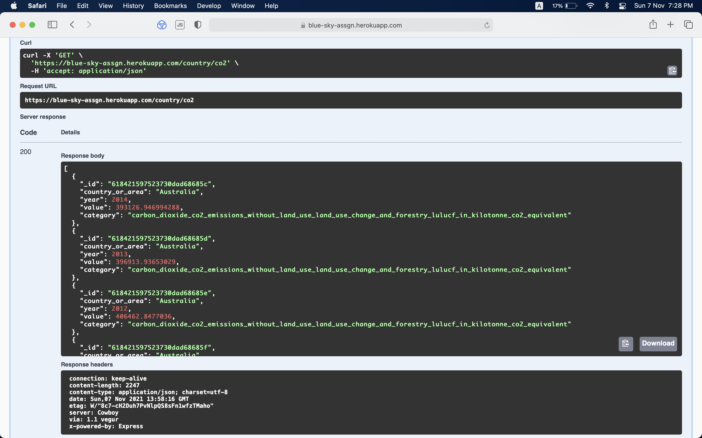

# Emissions Analytics

 

[Live working link](https://blue-sky-assgn.herokuapp.com)

### Introduction

This project retrieves emissions data of variour countries according to the search queries.
 

### What this application includes:

#### 1. Index page

#### 2. Explorer page

#### 3. API for retrieving all stored countries (/countries)

#### 4. API for retrieving countries according to params supplied (/country/{id})

