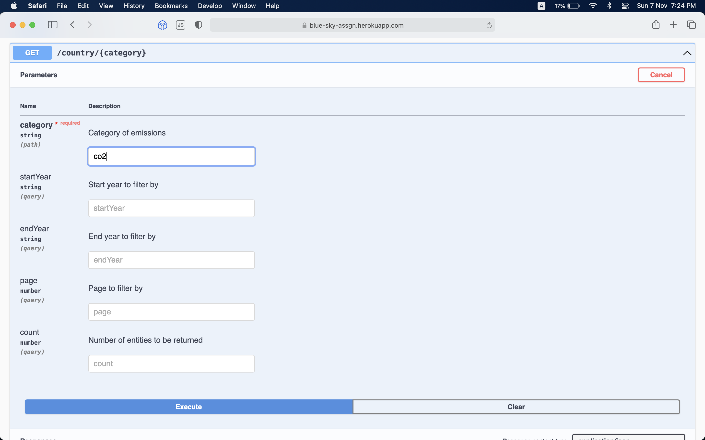

# Emissions Analytics

 

[Live working link](https://blue-sky-assgn.herokuapp.com)

### Introduction

This project retrieves emissions data of variour countries according to the search queries.
 

### What this application includes:

#### 1. Index page

 

#### 2. Explorer page

 

#### 3. API for retrieving all stored countries (/countries)

This API accepts "startYear", "endYear" for narrowing and "page", "count" for pagination in the query params.

 

 

#### 4. API for retrieving countries according to params supplied (/country/{category})

In addition to previous API's query params, this API accepts another {category} path param.
To retrieve entities with specific gas emissions, enter the chemical name of that gas as the "category" param.
For eg: co2 will give all entites with CO2 emissions. The query is letter case insensitive. co2, Co2 and CO2 will return same results.

For multiple emissions query : co2_n2o, co2 and n2o, co2n2o, CO2_N2o etc are all acceptable.
 

 

Result for the co2 query:
 

